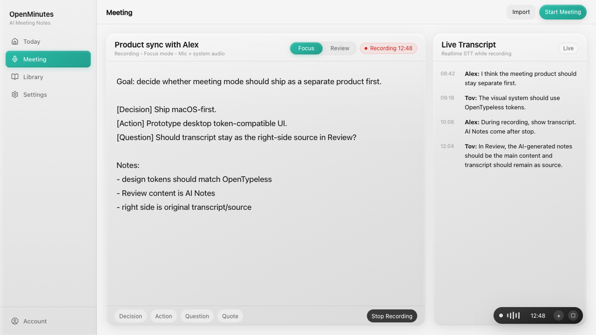
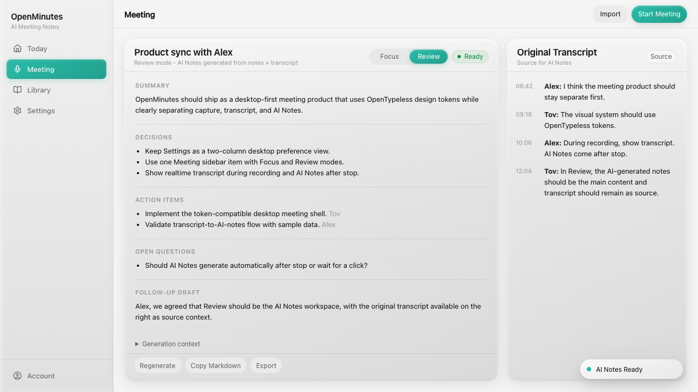
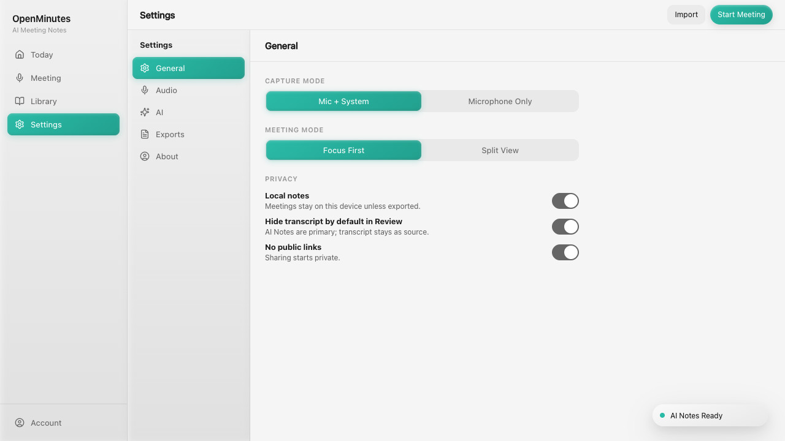
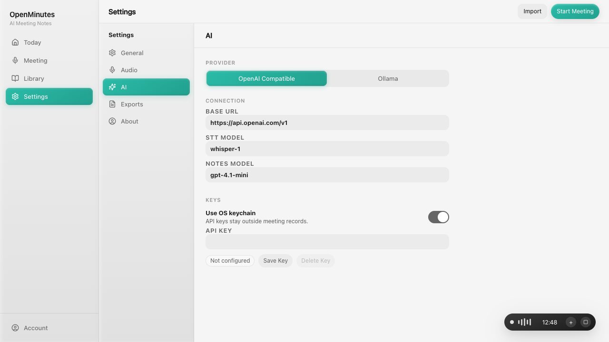
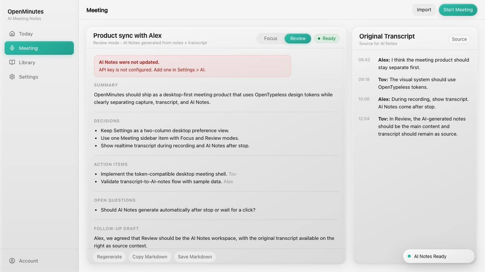
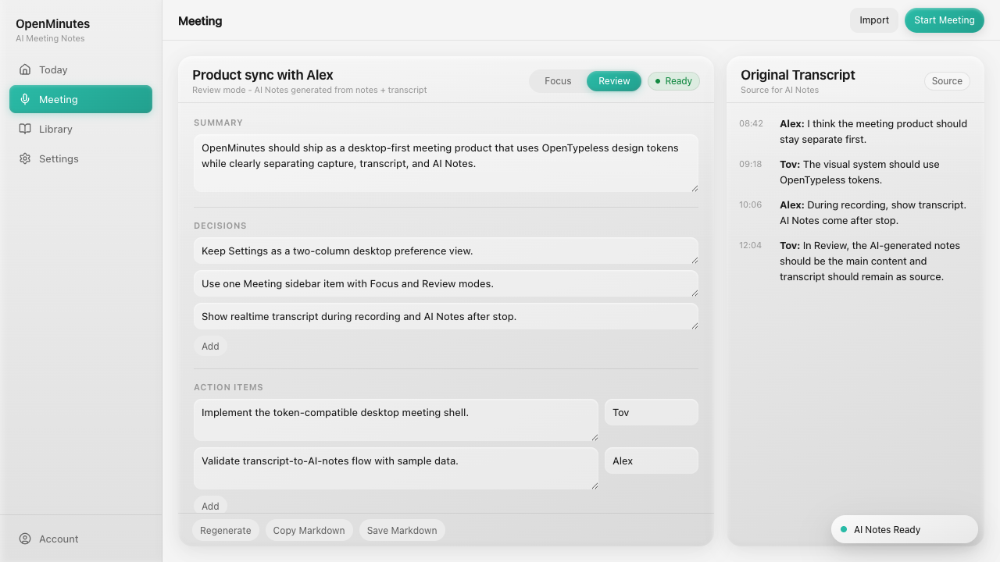
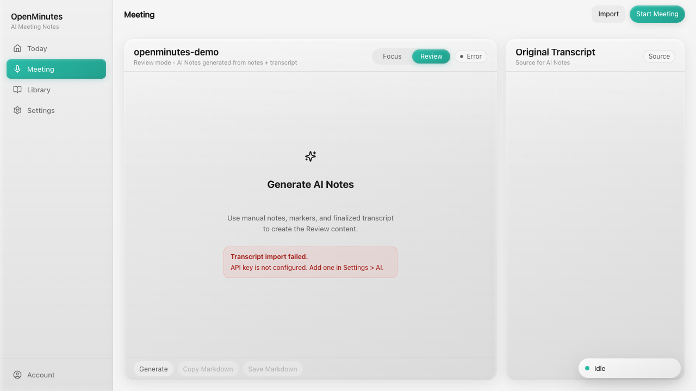
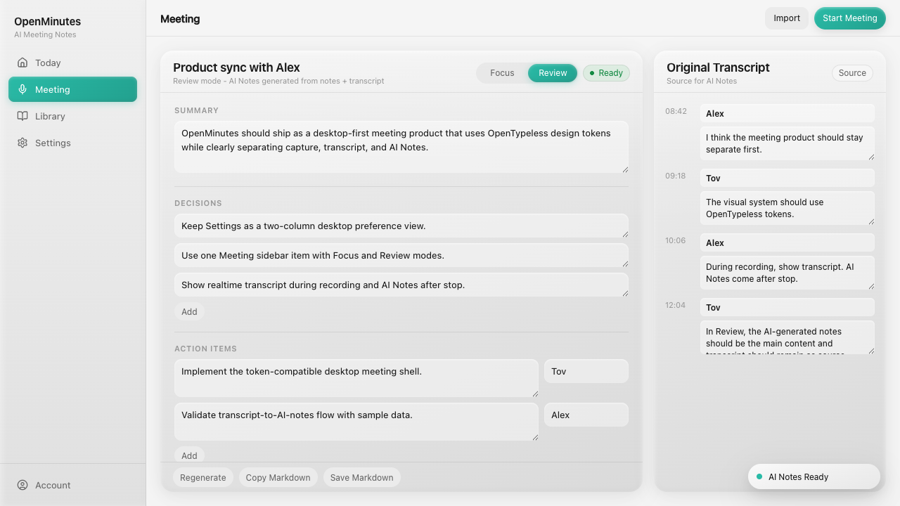

# OpenMinutes

OpenMinutes is an open-source, local-first AI meeting notes desktop app.

Status: early implementation scaffold.
License: MIT.

## Current Scope

- Product spec: `docs/2026-06-14-openminutes-product-spec.md`
- App source: `src/`
- Tauri shell: `src-tauri/`
- Desktop UI prototype for review: `prototypes/desktop-ui.html`
- Earlier web-style prototype for comparison: `prototypes/ui.html`

This first version locks the desktop product model before adding real audio, STT, LLM, and hosted export providers.

Implemented foundation:

- Meeting mode domain rules for Focus and Review.
- SQLite-backed desktop meeting repository with browser fallback for development/tests.
- SQLite-backed app settings for editable provider/export preferences.
- Provider interfaces for transcription and AI Notes generation.
- Mock STT and AI Notes providers for local development and tests.
- OS keychain-backed provider API key commands in the desktop shell.
- OpenAI-compatible AI Notes provider adapter behind the provider boundary.
- OpenAI-compatible STT provider adapter for imported audio files.
- Editable AI Notes in Review, including key points and action item owners.
- Editable original transcript source lines in Review.
- Native desktop audio file picker with browser fallback for testing STT before native capture.
- Retry affordance for failed audio import/STT setup.
- Review generate/regenerate failure states that preserve existing AI Notes.
- Markdown formatting for AI Notes export.
- Copy Markdown action in the Review workspace.
- Save Markdown action for desktop exports to `Documents/OpenMinutes`.

## Positioning

Stay present in meetings. Keep rough notes. Get finished, actionable meeting notes afterward.

## Screenshots

Focus keeps manual notes in the main pane and the live transcript on the right:



Review turns the meeting into AI Notes, with the original transcript kept as source:



Settings keeps the OpenTypeless-compatible two-column desktop preference layout:



AI provider keys are configured without displaying stored secrets:



Provider errors preserve the existing AI Notes in Review:



Review AI Notes are editable before copy/export:



Imported audio uses the STT provider path and surfaces configuration errors:



Original transcript lines are editable in Review:



Failed audio imports can be retried after configuration is fixed:


## Development

```bash
npm install
npm run dev
npm test
npm run build
npm run tauri -- dev
```

## Product Logic

- Focus mode is for live capture: manual notes and markers in the main pane, live transcript on the right.
- Review mode is for AI Notes: AI-generated notes in the main pane, original transcript on the right as source.
- Settings keeps the two-column desktop preference structure used by OpenTypeless.
- AI Notes exports default to the generated notes; transcript is included only when requested.

## Verification

```bash
npm test -- --run
npm run build
cargo fmt --manifest-path src-tauri/Cargo.toml --check
cargo check --manifest-path src-tauri/Cargo.toml
cargo test --manifest-path src-tauri/Cargo.toml
```
